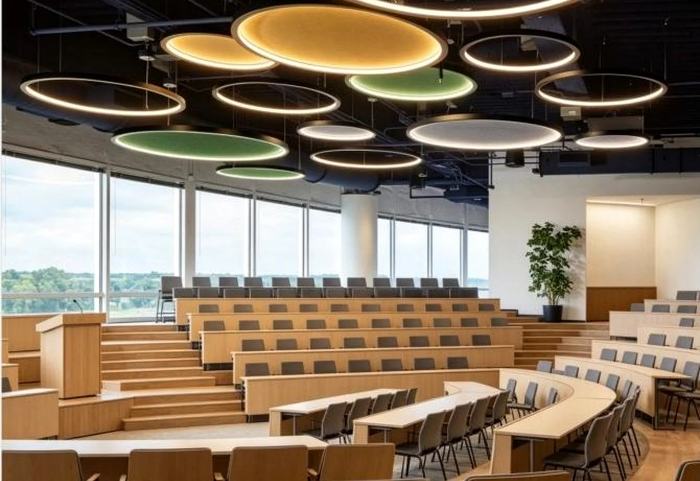

# KingOrnan Acoustic Lighting Homepage - Image Replacement Guide

This homepage currently uses network placeholder images from Unsplash. Replace them with your own product, factory and project images before publishing.

## Recommended image list

1. Hero image
- File suggestion: `assets/img/home/hero-acoustic-pendant.webp`
- Recommended size: 1600 × 1100 px
- AI prompt: Premium PET felt acoustic ring pendant light, grey felt texture, warm LED glow, modern office meeting room, architectural lighting photography, dark charcoal background, realistic, high-end B2B website hero image.

2. Product category: Acoustic Pendant Lights
- File suggestion: `assets/img/home/product-acoustic-pendant.webp`
- Recommended size: 900 × 700 px
- AI prompt: PET felt acoustic pendant lamp, clean white or grey felt material, warm light, modern commercial interior, realistic product photography.

3. Product category: Acoustic Linear Lights
- File suggestion: `assets/img/home/product-acoustic-linear.webp`
- Recommended size: 900 × 700 px
- AI prompt: Acoustic linear pendant light with PET felt baffle, modern open office ceiling, warm neutral light, architectural lighting photography.

4. Product category: Ceiling & Wall Acoustic Lighting
- File suggestion: `assets/img/home/product-ceiling-wall.webp`
- Recommended size: 900 × 700 px
- AI prompt: Acoustic ceiling and wall lighting system, PET felt panels integrated with LED light, premium interior, realistic B2B project photo.

5. Solution / office application image
- File suggestion: `assets/img/home/solution-office-acoustic-lighting.webp`
- Recommended size: 1200 × 900 px
- AI prompt: Modern coworking office with custom PET felt acoustic linear pendant lights, warm amber lighting, grey felt baffles, minimal premium interior, realistic architectural photography.

6. Application images
- Office & meeting room: `assets/img/home/app-office.webp`
- Education spaces: `assets/img/home/app-education.webp`
- Restaurant & hospitality: `assets/img/home/app-hospitality.webp`
- Commercial interiors: `assets/img/home/app-commercial.webp`

7. Factory images
- Main factory: `assets/img/home/factory-main.webp`
- Production detail: `assets/img/home/factory-production.webp`
- Warehouse / packaging: `assets/img/home/factory-warehouse.webp`

## How to replace

In `index.html`, search for `images.unsplash.com` and replace each `src="..."` with your own local image path, for example:

```html

```

Keep descriptive English `alt` text for SEO.
